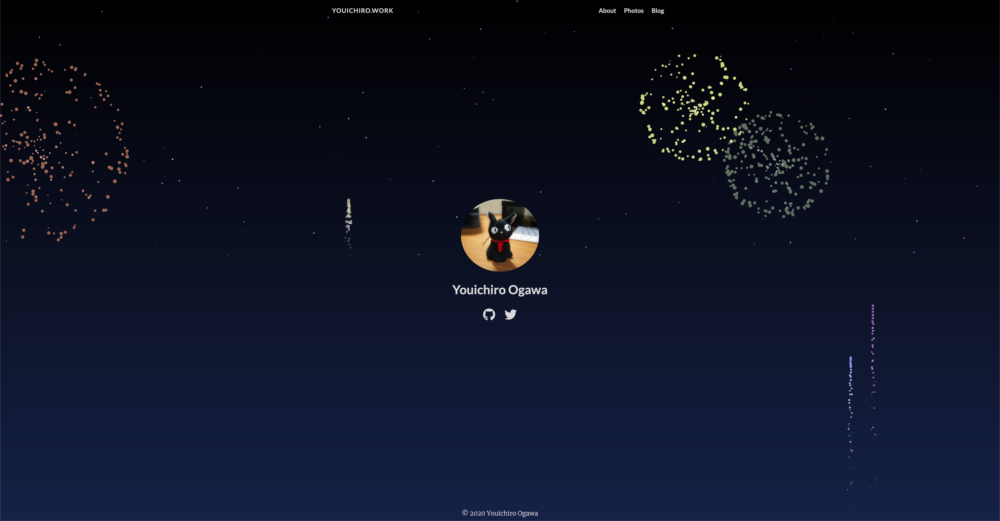

+++
draft = false
date = 2020-08-02T12:43:19+09:00
title = "花火を上げた"
description = ""
slug = "20200802"
tags = []
categories = []
externalLink = ""
series = []
+++

[トップページ](https://youichiro.work/)を開くと花火が上がるようにしました 
↓こんな感じ 

こちらの記事のコードを使わせていただきました → [JavaScriptで花火を作ってみよう！
](https://qiita.com/iNaoki04/items/5d420440cf3d89f54f82) 
HTMLファイルにこのJavaScriptのコードを追記するだけで花火が上がるようになります 
背景も星の綺麗な夜空になって素敵です 
今年は長岡花火が中止になってしまいましたが、復活する日を楽しみにしています 
