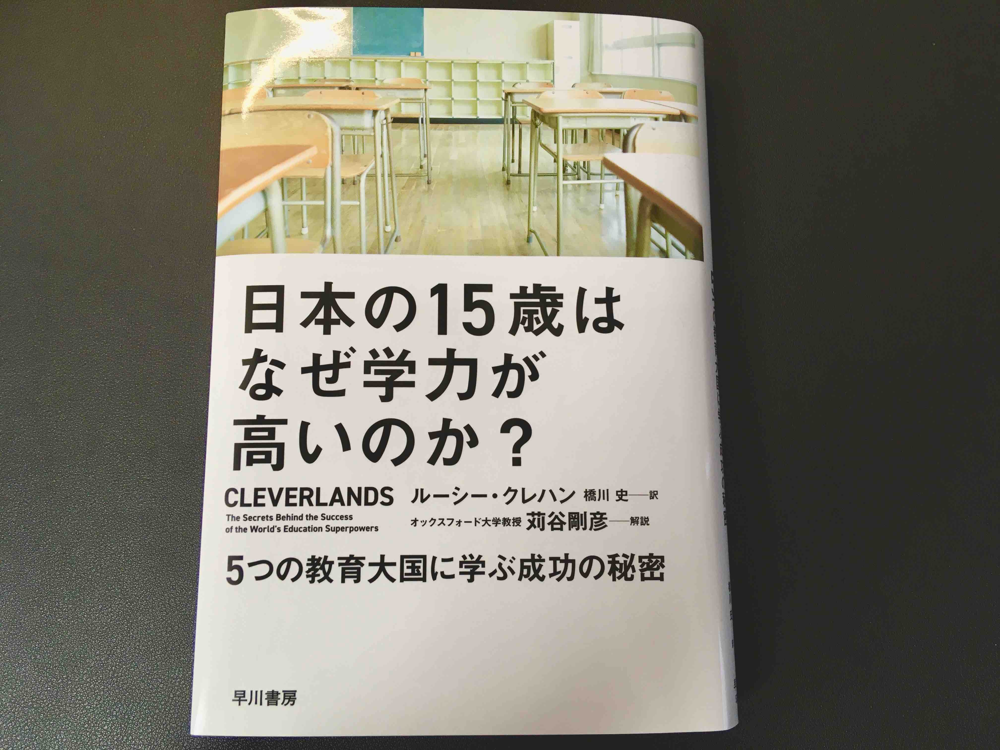

+++
draft = false
date = 2020-08-30T13:54:35+09:00
title = "「日本の15歳はなぜ学力が高いのか？」"
description = ""
slug = "2020-08-30"
tags = []
categories = []
externalLink = ""
series = []
+++

「日本の15歳はなぜ学力が高いのか？5つの教育大国に学ぶ成功の秘密」 
ルーシー クレハン（著） 橋川 史（翻訳） 苅谷 剛彦（解説） 
早川書房

[amazon](https://www.amazon.co.jp/%E6%97%A5%E6%9C%AC%E3%81%AE15%E6%AD%B3%E3%81%AF%E3%81%AA%E3%81%9C%E5%AD%A6%E5%8A%9B%E3%81%8C%E9%AB%98%E3%81%84%E3%81%AE%E3%81%8B-5%E3%81%A4%E3%81%AE%E6%95%99%E8%82%B2%E5%A4%A7%E5%9B%BD%E3%81%AB%E5%AD%A6%E3%81%B6%E6%88%90%E5%8A%9F%E3%81%AE%E7%A7%98%E5%AF%86-%E3%83%AB%E3%83%BC%E3%82%B7%E3%83%BC-%E3%82%AF%E3%83%AC%E3%83%8F%E3%83%B3/dp/4152097159/ref=tmm_hrd_swatch_0?_encoding=UTF8&qid=1598763790&sr=8-1)

イギリス人教師が[PISA（学力到達調査）](https://www.nier.go.jp/kokusai/pisa/)で高得点をあげた国々を選び、学校を訪問する旅に出た話です。
フィンランド、日本、シンガポール、中国、カナダを渡り歩き、それぞれの国の教育システムや教育の歴史、教育に対する考え方に触れていきます。
これらは国によってかなり違うことを知りました。

日本では「教室」という箱から出てはいけない。`出る杭は打たれる` ので、周囲の人と違うことをしたり迷惑なことをしたりしてはいけないということを学ぶ。
でもこれは、当たり前ではないんだ。

この本の第17章「高い成果と公平性を実現するための5つの原則」では、国によって広さや多様性、歴史などどれをとっても大きく異なるなかで、根底にはいくつかの共通点があることを見出します。
筆者は高い成果があがり、かつ公平な教育システムの基礎となりうる5つの原則を提言しています。
参考になるのでここにまとめます。

 

以下、引用です。

---

##### 原則1：子どもたちに学校で勉強する準備をさせる
- **豊かな環境と、遊ぶながら学ぶことを通して、6歳までに社会的スキルと学習に向けたスキルを身につけさせる。子どもたちには特定の学習成果を求めない。**
- **早い時期に時間をかけて授業のパターンを教える。**
- **子どもたち（と教師）のために、授業の合い間に10〜15分の休憩を設ける。**
- **学習以外の問題に対処することのできる専門家を学校に置く。**

##### 原則2：きちんと習得できるカリキュラム（そしてやる気の出る授業内容）を作る
- 優れた国定カリキュラム（州・省の場合も）は
  - **項目が少ない**
    - 学ぶ項目の数を絞って、それぞれを深く掘り下げている。
  - **レベルが高い**
    - どんな概念やスキルが必要とされるかを明確に示し、文脈や教え方について指図しない。
  - **順序立っている**
    - 学習プロセスに関する研究に基づき、論理的な順序で概念を数えている。

##### 原則3：低いレベルで妥協せず、子どもたちが向上を目指すようにサポートする
- **能力別の学校振り分け年齢を15〜16際まで延ばす。**
- **15〜16歳までは能力混成クラスで教える。**
- **授業前、授業中、授業後のいつでも、資格を持つ専門家による、柔軟性のある少人数グループのサポートを受けられるようにする。**

##### 原則4：教師を「専門家」として待遇する
- **教師の養成には、少なくとも1年間の厳しいトレーニングプログラムを課す。その養成プログラムは専門機関の承認を受け、教育に関する専門知識を習得するものでなくてはならない。**
- **資格を取得したばかりの教師は、授業時間を少なくし、同じく授業時間を減らした先輩教師から指導を受ける時間を確保する。教師たちが少人数で集まって授業計画を立てたり、授業を評価したりすることを奨励し、すべての教師が教育面で互いに支え合い、学び合えるようにする。**

##### 原則5：学校の成績責任と学校へのサポート（制裁ではなく）を両立させる
- **学校単位のデータや不定期の全国的調査を利用して、国家レベルあるいは地方レベルで学校の活動状況を観察する。**
- **優れた元校長たちのネットワークを活用し、定期的に学校訪問をしたり、現役の校長にアドバイスやサポートをする。**
- **優れた教師や指導者にやる気を起こさせ、問題のある学校で仕事をさせて、他の教師たちにも教育的指導力を分け与える。**
